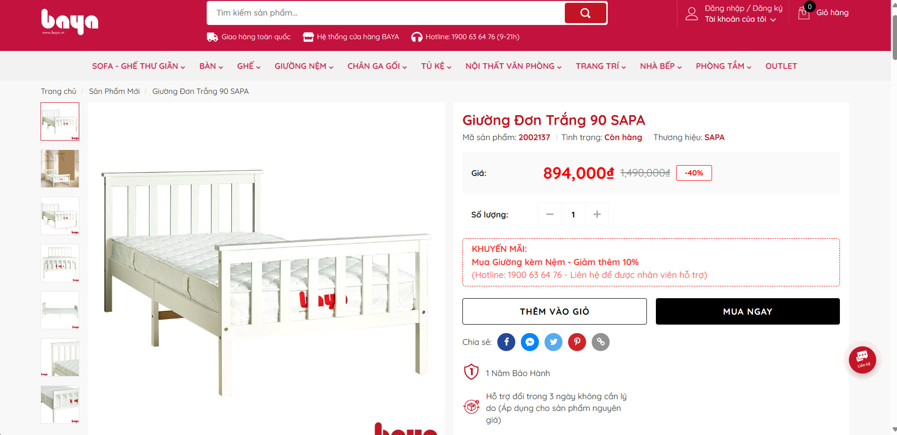

# Chào mừng đến với Website mua sắm nội thất 

Chào mừng bạn đến với trang web mua bán nội thất của chúng tôi! Chúng tôi tự hào mang đến cho bạn một trải nghiệm mua sắm trực tuyến tiện lợi và đa dạng. Với một bộ sưu tập đa dạng các sản phẩm nội thất từ các nhà sản xuất uy tín và các thương hiệu hàng đầu, chúng tôi cam kết cung cấp những sản phẩm chất lượng và phong cách phù hợp với mọi không gian sống.

Hiện tại web đang trong giai đoạn phát triển, nếu muốn trải nghiệm hãy tải sản phẩm về.

## Người đóng góp
| Họ và tên             | Vai trò                                                                |
| ----------------- | ------------------------------------------------------------------ |
|[Nguyễn Quang Thắng](https://github.com/quangthang1307) | Quản lý dự án, Phát triển |  
|[Tạ Thiên Bảo](https://github.com/baottpc04782) | Phát triển Back-End |  
|[Hồ Phủ Vàng](https://github.com/hophuvang0111) | Phát triển Fullstack | 
|[Huỳnh Sĩ Đan](https://github.com/danbroone1) | Phát triển Back-End |
|[Phan Quốc Thái](https://github.com/phanquocthai198) | Phát triển Back-End |
|[Đặng Liên Dũng](https://github.com/DungDan) | Phát triển Fullstack |

## Về trang web

1. **Tạo tài khoản cá nhân**: Mua sắm các mặt hàng, sản phẩm nội thất.
2. **Flash Sale theo khung giờ**: Săn các sản phẩm giá hời theo các khung giờ.
3. **Tương Tác Xã Hội**: Tích hợp các tính năng xã hội như bình luận, đánh giá sản phẩm.

### Chức năng chính
- Đăng nhập, Đăng ký: Xác thực JWT,...
- Tìm kiếm: Ajax, AngularJs.
- Chat tin nhắn: Socket.io, StockJS.
- Quản lý tài khoản: Spring Boot.

## Một số giao diện

- Giao diện chính:

- Giao diện sản phẩm:

- Giao diện chi tiết sản phẩm: 

#### Back-end (SpringBoot)
- Bảo vệ Đăng nhập bằng Spring Security, JWT Token.
- Đăng nhập bằng Google, Facebook.
- Xác thực Json Web Token
- Bộ lọc ủy quyền Spring Security
- Xử lý lỗi nhãn trắng (403, 404, 500, ...)

#### Front-end (AngularJs)
- Intercepter
- Bảo vệ
- Định tuyến
- Xác thực Form

#### Cơ sở dữ liệu (SQL Server)

## Kỹ thuật sử dụng

Spring Boot, AngularJs, Socket.io, JQuery, Bootstrap v5, Thymeleaf template angine.

